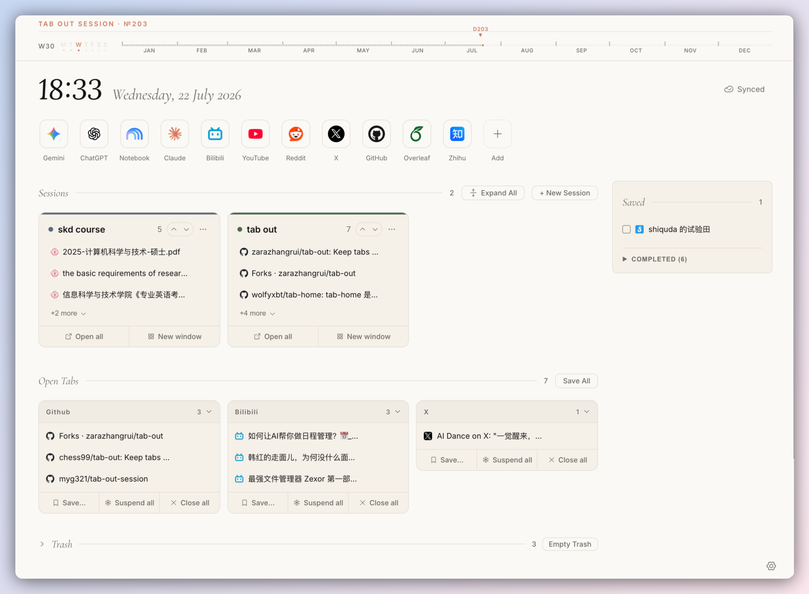
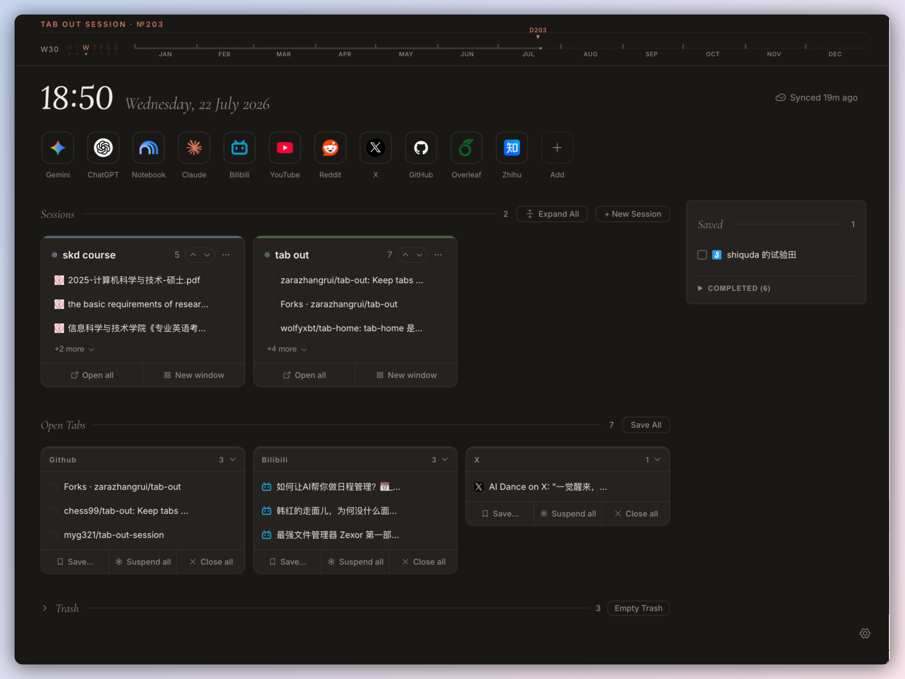
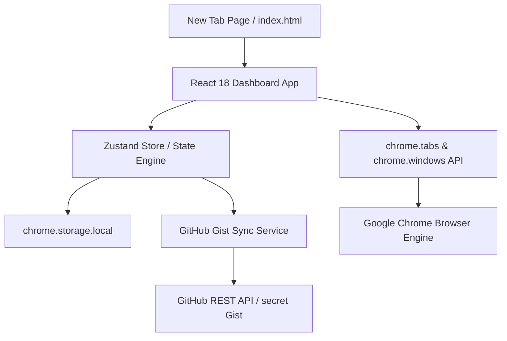

# Tab Out Session

<div align="center">

# 🌿 Tab Out Session

**Transforming Tab Overload into Intentional, Focused Workflows.**

A high-performance Chrome Manifest V3 New Tab extension built for focus, domain-level tab organization, and seamless session management.

[](https://developer.chrome.com/docs/extensions/mv3/intro/)
[](https://react.dev/)
[](https://www.typescriptlang.org/)
[](https://vitejs.dev/)
[](./LICENSE)
[](https://github.com/myg321/tab-out-session#privacy--security)

</div>

---

## 📖 Product Positioning

**Tab Out Session** reimagines the browser's New Tab page into an editorial, human-centered dashboard that cures tab sprawl. Forked from [Tab Out Mission](https://github.com/Logan-tree/tab-out-mission) (which adapted Zara's original Tab Out concept), it combines the beloved **Year Progress topbar** with modern **Session Management** and **Bookmark Buddy** productivity workflows.

Most tab managers operate as separate, disconnected popup menus or cluttered bookmark lists. **Tab Out Session** turns every new tab into an active work surface, helping knowledge workers, developers, and researchers structure chaotic browsing contexts into intentional, color-coded work sessions.

### Key Value Pillars

- 🗂️ **Session Management First**: Store, categorize, and restore tab collections seamlessly with an adaptive 3-state accordion system.
- ⚡ **Instant Extension Toolbar Popup**: Park any active webpage directly into a Session or Save for Later with one click from the Chrome toolbar.
- 🔐 **Encrypted Cloud Sync**: Sync all sessions, quick sites, and settings across machines via encrypted GitHub Gists — no middleman servers, no accounts, 100% user-owned.
- 🎨 **Harmonious & Refined Design System**:
  - **Automatic Light/Dark Mode**: Seamlessly adapts to your system OS appearance.
  - **Cohesive Typography & Earth Tones**: Curated Fraunces display typography paired with warm canvas palettes.
  - **Delightful Micro-interactions**: Subtle touches like handwritten fountain pen strikethrough animations when completing reading items.
- 🎯 **Domain-Level Tab Control**: Group active tabs automatically by domain name, eliminate duplicates across windows, and batch save entire clusters.
- ⏳ **Temporal Grounding**: Maintain acute awareness of time with the Year Progress topbar inherited from Tab Out Mission.

---

## 🖼️ Visual Preview

Below is the complete dashboard interface of **Tab Out Session** showing all core features in Light Mode and Dark Mode.

### Light Mode (Warm Canvas Theme)



---

### Dark Mode (Midnight Theme)



---

## ✨ Core Feature Highlights

### 1. 🗂️ Session Management System
- **3-State Adaptive Accordions**:
  1. 📁 **Collapsed State**: Sleek 1-line header bar with title, color tag, and tab count.
  2. 🔍 **Partial Preview State**: Displays the top 3 primary tabs for quick context scanning without taking up full vertical space.
  3. 📂 **Full Expanded State**: Complete list of saved links with single tab deletion, copy URL, and drag ordering.
- **Earth & Gem Color Tagging**: Organize work, research, personal, and project sessions using 8 curated color palettes (`clay`, `sage`, `slate`, `terra`, `rose`, `moss`, `indigo`, `sand`).
- **Flexible Restoration**: Restore entire sessions in your current window or spin up a dedicated Chrome window.
- **30-Day Trash Retention**: Accidental session deletions move to a local Trash Bin with 30-day retention and one-click restoration.

### 2. ⚡ Instant Extension Toolbar Popup
- **On-the-Fly Tab Parking**: Click the **Tab Out Session** icon in your Chrome extensions toolbar anytime while browsing to park your current webpage instantly.
- **One-Click Destination Selection**: Save the active tab directly into any existing Session, stash it into "Save for Later", or create a brand new Session on the fly without interrupting your browsing flow.
- **Instant Real-Time Sync**: Parking a tab via the popup updates `chrome.storage.local` immediately, ensuring your New Tab dashboard is instantly in sync across all windows.

### 3. 🔐 Encrypted GitHub Gist Cloud Sync
- **Zero Middleman Servers**: Connect directly from your browser to GitHub's REST API using a standard Personal Access Token (PAT).
- **Secret Gist Storage**: Data is saved into an isolated, secret GitHub Gist (`tab-out-session-data.json`), giving you 100% control over your personal data.
- **Bi-directional Merging & Tombstones**: Intelligent conflict resolution synchronizes Sessions, Quick Sites, Save for Later items, and user Settings across multiple computers without resurrecting deleted items.
- **Live Status Indicator**: Visual header badge reflecting real-time sync state (`Synced`, `Syncing`, `Sync error`).

### 3. 🌐 Open Tabs Domain Grouping
- **Smart Auto-Grouping**: Automatically aggregates all open tabs across Chrome windows by domain name, host, and port (including full `localhost:PORT` distinction for developers).
- **One-Click Batch Actions**:
  - 📥 **Save to Session**: Turn any domain tab group into a permanent, named session.
  - 🧹 **Deduplicate**: Remove duplicate open tabs sharing identical URLs across windows.
  - ❌ **Close Group**: Safely close all tabs in a domain group after saving.
- **Cross-Window Tab Focus**: Click any tab title to instantly focus and bring that specific Chrome tab/window to the foreground.

### 4. ⚡ Quick Sites Tile System
- **Custom Canvas Cropper**: Built-in HTML5 canvas cropper tool that lets you crop, scale, and adjust custom icon upload images for your bookmarks.
- **Adaptive Tile Geometry**: Switch seamlessly between **Squircle** (Apple-style continuous curvature) and **Circle** tile styles.
- **Color Backfilling**: Preset color swatches and EyeDropper color picker for transparent PNGs.
- **Offline Base64 Caching**: Icons are converted into optimized Base64 Data URLs and saved directly in `chrome.storage.local`, ensuring 100% reliable displays even when completely offline.

### 5. ✍️ Save for Later Checklist
- **Frictionless Reading Stash**: Quick-add temporary URLs and reading items without polluting your long-term bookmark tree.
- **Handwritten Fountain Pen Strikethrough**: Checking off a completed item triggers a multi-line SVG pen stroke animation (`strikeThroughMultiLine`) across text lines, followed by a smooth slide-down archiving effect.
- **Completed Archive**: Filter and clear completed items effortlessly.

### 6. ⌛ Year Progress Topbar & Serif Clock
- **Temporal Context**: Integrated real-time timeline displaying the exact percentage of the current year elapsed (`YEAR PROGRESS: XX.X%`), inherited from Tab Out Mission.
- **Editorial Typography**: Elegant display clock powered by the classic **Fraunces** serif font family.

---

## 🛠️ Architecture & Tech Stack



| Domain | Technology / Tools |
| :--- | :--- |
| **Extension Standard** | Chrome Extension Manifest V3 |
| **UI Framework** | React 18, TypeScript 5.2 |
| **State Management** | Zustand 4.5 |
| **Build Tooling** | Vite 5.3 + `@samrum/vite-plugin-web-extension` |
| **Icons & Typography** | `@phosphor-icons/react`, Fraunces, Inter |
| **Storage & Sync** | `chrome.storage.local`, GitHub Gist API (REST v3) |

---

## 🚀 Installation & Setup

### Method 1: Install via AI Coding Agent (Recommended)

Pass this repository URL to your AI Coding Agent (**Claude Code**, **Google Antigravity**, **Cursor**, **Windsurf**, or **Codex**) and tell it: `"install this"`:

```text
https://github.com/myg321/tab-out-session
```

The AI agent will read [`AGENTS.md`](./AGENTS.md), clone the repository, install dependencies, compile `extension-react/dist`, copy the extension path to your clipboard, and guide you through Chrome loading in ~1 minute.

---

### Method 2: Manual Installation

**Step 1: Clone Repository & Setup Node Environment**

```bash
# Clone the repository
git clone https://github.com/myg321/tab-out-session.git
cd tab-out-session

# Option A: Using fnm (Recommended)
fnm install 20
fnm use 20

# Option B: Using nvm
nvm install 20
nvm use 20
```

**Step 2: Install Dependencies & Build Bundle**

```bash
# Navigate to the React extension directory
cd extension-react

# Option A: Using pnpm (Recommended)
pnpm install
pnpm build

# Option B: Using npm
npm install
npm run build
```

**Step 3: Load Extension into Chrome**

1. Open **Google Chrome** and navigate to `chrome://extensions`.
2. Enable **Developer mode** using the toggle switch in the top-right corner.
3. Click the **Load unpacked** button in the top-left toolbar.
4. Browse to your local project directory and select the build folder:
   ```text
   /path/to/tab-out-session/extension-react/dist
   ```
5. Open a **New Tab** (`Cmd + T` on macOS, `Ctrl + T` on Windows/Linux) to launch your new **Tab Out Session** dashboard!

---

### Development Mode (Hot Reloading)

```bash
cd extension-react
pnpm dev # or npm run dev
```

---

## 🔒 Privacy & Security

**Tab Out Session is built with privacy as a fundamental constraint.**

- 🚫 **No Server**: We do not run any servers, databases, or analytics services.
- 🚫 **No Tracking / Telemetry**: Zero user tracking, cookies, or telemetry code.
- 🔐 **Encrypted Gist Sync**: Cloud synchronization communicates **directly** with GitHub's HTTPS API using your personal token. Your data is stored in your private Gist and never touches any third-party infrastructure.

---

## 🤝 Contributing

Contributions, feature ideas, and visual refinements are welcome!

1. Fork the Repository (`https://github.com/myg321/tab-out-session`).
2. Create a Feature Branch (`git checkout -b feature/amazing-feature`).
3. Commit your changes (`git commit -m 'Add amazing feature'`).
4. Push to the Branch (`git push origin feature/amazing-feature`).
5. Open a Pull Request.

---

## 📜 License

This project is licensed under the **MIT License** - see the [LICENSE](./LICENSE) file for details.

---

## 🙏 Acknowledgements

- Forked from **[Tab Out Mission](https://github.com/Logan-tree/tab-out-mission)**, from which we inherited the beloved **Year Progress topbar** concept.
- Inspired by the core temporal philosophy of **[Tab Out](https://github.com/zarazhangrui/tab-out)** by Zara.
- Built with React 18, Vite, and Chrome Manifest V3 APIs.

---

<div align="center">
  <sub>Crafted with focus & intention by <a href="https://github.com/myg321">myg321</a> and open-source contributors.</sub>
</div>
