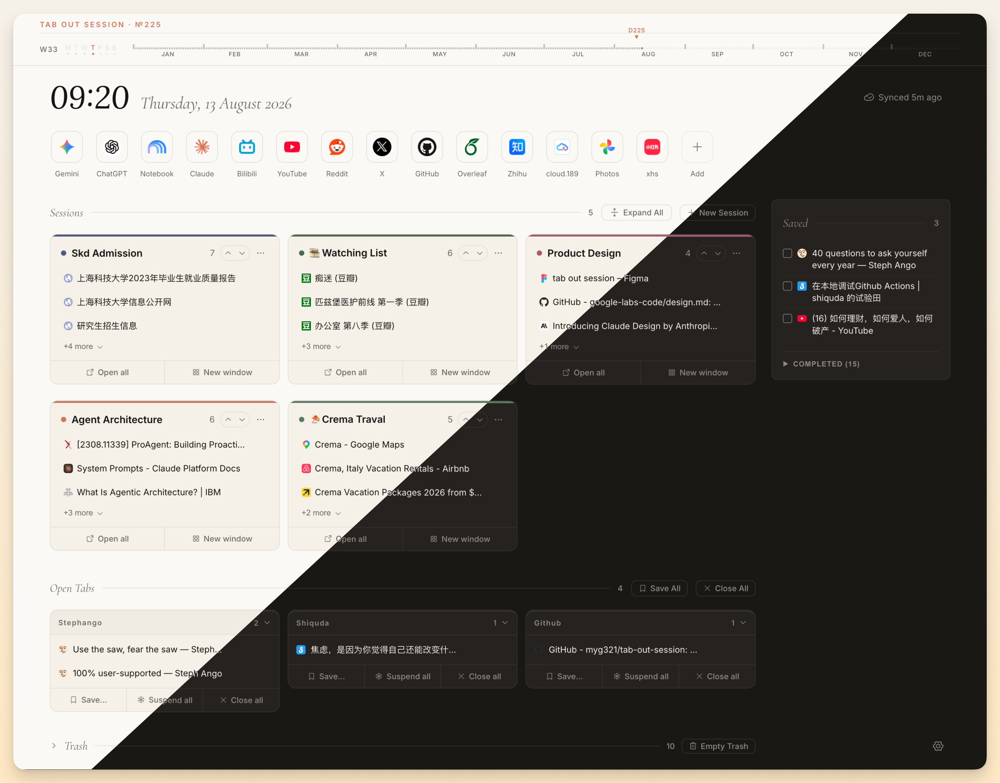

<div align="center">
  <h1>Tab Out Session</h1>
  <p><em>Transforming Tab Overload into Intentional, Focused Workflows.</em></p>
</div>

<p align="center">
  <a href="https://developer.chrome.com/docs/extensions/mv3/intro/"></a>
  <a href="https://react.dev/"></a>
  <a href="https://www.typescriptlang.org/"></a>
  <a href="https://vitejs.dev/"></a>
  <a href="./LICENSE"></a>
  <a href="#privacy--security-design"></a>
</p>

<p align="center">
  
</p>

---

## Features

- **Tab Session Card Management**: Manage and store multi-tab sessions directly inside Chrome's New Tab page. Presented as adaptive visual cards tailored to your daily workflow—so your curated tab collections no longer sit rotting and forgotten in plain bookmark lists! Features 3-state accordions (Collapsed, Partial preview, Full expanded), free drag-and-drop of tabs between session cards, and a dedicated Save for Later reading stash.
- **Encrypted Zero-Server Cloud Sync**: Automatic GitHub Gist backup using Personal Access Tokens—no accounts, no third-party servers, 100% user-owned and non-perishable.
- **Domain-Grouped Open Tabs Manager**: Auto-group open tabs across windows by domain name, host, and port; batch close, suspend memory, or deduplicate; drag any open tab directly into any session card; strict safety protection for pinned tabs and standalone PWA desktop app windows.
- **Quick Sites Studio & Year Progress**: Custom icon cropper (squircle/circle mask, pan/zoom, background color fill) with Base64 offline caching; free tile drag reordering; real-time Year Progress timeline bar and Fraunces serif clock that keep you mindfully grounded in the present moment.
- **Popup & Right-Click Context Menu**: Extension toolbar popup for 1-click tab parking into any session while browsing; mouse right-click context menu on any webpage link to silently park URLs into sessions without interrupting your reading flow.

---

## Quick Start

### Method 1: Pre-built Release (Recommended for All Users)

No Node.js, pnpm, or terminal required. Download the ready-to-use extension bundle in 1 minute:

1. Download the latest `tab-out-session-vX.X.X.zip` from the [GitHub Releases Page](https://github.com/myg321/tab-out-session/releases/latest).
2. Extract the downloaded ZIP archive on your computer.
3. Open **Google Chrome** and navigate to `chrome://extensions`.
4. Enable **Developer mode** using the toggle switch in the top-right corner.
5. Click **Load unpacked** (top-left button) and select the extracted folder.
6. Open a new tab (**Cmd + T** on macOS, **Ctrl + T** on Windows/Linux) to launch Tab Out Session.

---

### Method 2: Build from Source (For Developers)

```bash
git clone https://github.com/myg321/tab-out-session.git
cd tab-out-session/extension-react
pnpm install && pnpm build
```

Then load `extension-react/dist` into `chrome://extensions`.

---

## Privacy & Security Design

Tab Out Session is built with privacy as a fundamental constraint:

- **Zero Server**: No servers, databases, or analytics services are operated or queried by the extension.
- **Zero Tracking**: Zero user tracking, cookies, or telemetry code.
- **Encrypted Gist Sync**: Cloud synchronization communicates directly with GitHub's HTTPS API using your personal access token. Data is stored in your private secret Gist and never touches third-party infrastructure.

---

## Features in Detail

### Card-Based Session Management Engine

- **3-State Adaptive Accordions**:
  - **Collapsed State**: Sleek 1-line header bar with title, color tag, and tab count.
  - **Partial Preview State**: Displays the top 3 primary tabs for quick context scanning without taking up full vertical space.
  - **Full Expanded State**: Complete list of saved links with single tab deletion, copy URL, and drag ordering.
- **Card and Tab Drag-and-Drop Reordering**:
  - **Card Reordering**: Drag any session card by its title bar to rearrange your session grid.
  - **Intra-Session Tab Reordering**: Drag saved links within a session card to reorder your workflow sequence.
  - **Inter-Session Tab Dragging**: Drag tabs from one session card directly into another session card.
- **Earth & Gem Color Tagging**: Organize work, research, personal, and project sessions using 8 curated color palettes (clay, sage, slate, terra, rose, moss, indigo, sand).
- **Flexible Restoration**: Restore entire sessions in your current window or spin up a dedicated Chrome window.
- **30-Day Trash Retention**: Accidental session deletions move to a local Trash Bin with 30-day retention and one-click restoration.

### Open Tabs & Safety Architecture

- **Domain and Port Auto-Grouping**: Automatically aggregates all open tabs across Chrome windows by domain name, host, and port (including full localhost distinction for developers).
- **Standalone PWA Desktop App Window Protection**: Built-in filtering setting that detects standalone desktop PWA windows (Google Calendar, Notion, Teams, etc.) and excludes them from batch operations so standalone desktop windows are never closed accidentally.
- **Pinned Tab Protection**: Pinned tabs are immune to batch closure operations regardless of tab visibility settings.
- **One-Click Batch Operations**:
  - **Save to Session**: Turn any domain tab group into a permanent, named session card.
  - **Save to Save for Later**: Move domain tab groups into the reading checklist.
  - **Deduplicate**: Remove duplicate open tabs sharing identical URLs across windows.
  - **Close Group / Close All**: Safely close tabs or domain groups with mandatory pinned and PWA app tab protection.
- **Interactive Tab Drag-to-Session**: Drag any open tab chip directly from the Open Tabs grid into any session card.

### Encrypted GitHub Gist Cloud Sync

- **Direct GitHub REST Integration**: Communicates directly with GitHub's HTTPS API using Personal Access Tokens.
- **Secret Gist Storage**: Data is saved into an isolated, secret GitHub Gist, giving you 100% control over your personal data.
- **Bi-directional State & Order Merging**: Synchronizes Sessions, custom drag-and-drop order positions, Quick Sites, Save for Later items, and user Settings across multiple computers without resurrecting deleted items.
- **Live Status Indicator**: Visual header badge reflecting real-time sync state (Synced, Syncing, Sync error).

### Quick Sites Canvas Cropper & Icon Studio

- **Custom Image Upload & Web URL Address Fetching**: Upload local image files or paste any public image URL address to fetch custom icons.
- **Interactive Canvas Cropper**: HTML5 canvas cropper tool that lets you crop, scale, pan, mask (Squircle or Circle shapes), and fill custom background colors.
- **Tile Drag-and-Drop Reordering**: Drag tiles freely to customize your shortcut grid layout.
- **Offline Base64 Caching**: Icons are converted into optimized Base64 Data URLs and saved directly in Chrome local storage, ensuring reliable displays even when completely offline.

### Save for Later Checklist

- **Frictionless Reading Stash**: Quick-add temporary URLs and reading items without polluting your long-term bookmark tree.
- **Drag-and-Drop Reordering**: Drag reading items up and down to prioritize your reading queue.
- **Handwritten Fountain Pen Strikethrough**: Checking off a completed item triggers a multi-line SVG pen stroke animation across text lines, followed by a smooth slide-down archiving effect.
- **Completed Archive**: Filter and clear completed items effortlessly.

### Extension Toolbar Popup & Right-Click Context Menu

- **On-the-Fly Toolbar Parking**: Click the Tab Out Session icon in your Chrome extensions toolbar anytime while browsing to park your current webpage instantly.
- **Destination Selection**: Save the active tab directly into any existing Session, stash it into Save for Later, or create a new Session on the fly.
- **Mouse Right-Click Context Menu**: Right-click any webpage link address while reading to silently park URLs into sessions without interrupting your flow.

### Year Progress Topbar & Editorial Typography

- **Temporal Context**: Integrated real-time timeline displaying the exact percentage of the current year elapsed, keeping you mindfully grounded in the present moment.
- **Editorial Typography**: Elegant display clock powered by the classic Fraunces serif font family paired with Inter body font.

---

## Tech Stack

| Domain | Technology / Tools |
|---|---|
| **Extension Standard** | Chrome Extension Manifest V3 |
| **UI Framework** | React 18, TypeScript 5.2 |
| **State Management** | Zustand 4.5 |
| **Build Tooling** | Vite 5.3 + `@samrum/vite-plugin-web-extension` |
| **Icons & Typography** | `@phosphor-icons/react`, Fraunces, Inter |
| **Storage & Sync** | `chrome.storage.local`, GitHub Gist API (REST v3) |

---

## Contributing

Contributions, feature ideas, and bug reports are welcome! Feel free to open a Pull Request or issue on GitHub.

---

## License

This project is licensed under the **MIT License** - see the [LICENSE](./LICENSE) file for details.

---

## Acknowledgements

- Forked from **[Tab Out Mission](https://github.com/Logan-tree/tab-out-mission)**, from which we inherited the beloved Year Progress topbar concept.
- Inspired by the core temporal philosophy of **[Tab Out](https://github.com/zarazhangrui/tab-out)** by Zara.

---

<div align="center">
  <sub>Crafted with focus & intention by <a href="https://github.com/myg321">myg321</a> and open-source contributors.</sub>
</div>
